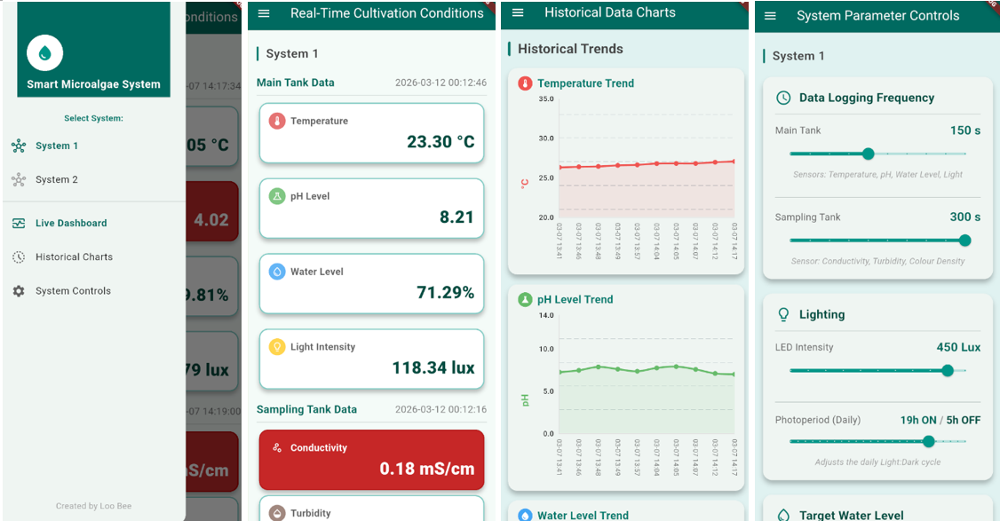
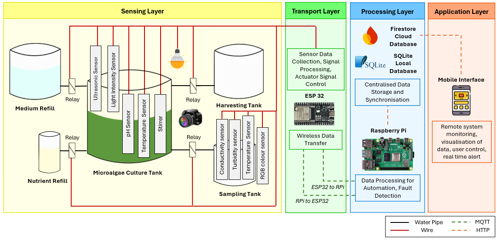
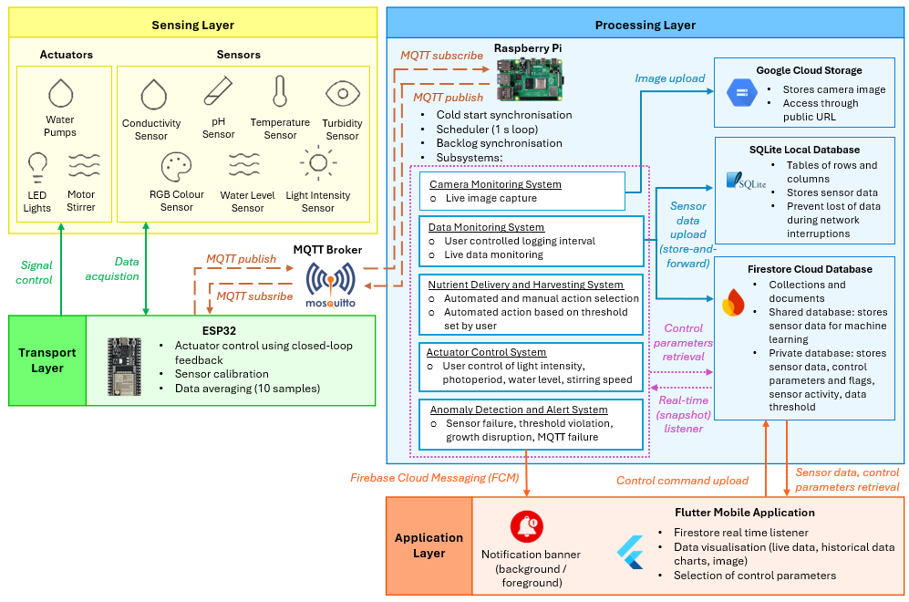

# 🌱 IoT-Based Smart Cultivation System for Microalgae

An end-to-end Internet of Things (IoT) platform for automated microalgae cultivation, integrating environmental monitoring, automated control systems, cloud databases, image monitoring, anomaly detection, and a Flutter mobile application.

Developed as a Final Year Engineering Project in collaboration with **Algae International Berhad (AIB)**, this system demonstrates a scalable and low-cost architecture for smart microalgae cultivation using ESP32, Raspberry Pi, MQTT, Firebase, and Flutter technologies.

---

## Project Highlights

✅ 7 Environmental Sensors Integrated

✅ 6 Automated Actuator Subsystems

✅ MQTT-Based Real-Time Communication

✅ Raspberry Pi Edge Processing

✅ Firebase Cloud Synchronisation

✅ SQLite Local Database Backup

✅ Flutter Mobile Application

✅ Camera-Based Remote Monitoring

✅ Automated Nutrient Dosing & Harvesting

✅ Multi-System Scalable Architecture

---

# System Overview

## Smart Cultivation Platform


*Complete cultivation system integrating sensing, automation, cloud connectivity, and remote monitoring.*

---

## Mobile Application Dashboard



*Flutter mobile application for real-time monitoring, historical trend analysis, actuator control, and user alert.*

---

## Four-Layer IoT Architecture



*System architecture showing the interaction between sensing, transport, processing, and application layers.*

---

## Functional Flow



*End-to-end data flow and control flow throughout the cultivation platform.*

---

# Project Overview

Microalgae cultivation requires continuous monitoring and control of environmental conditions such as temperature, pH, nutrient concentration, light intensity, and biomass density. Traditional cultivation methods rely heavily on manual intervention, resulting in delayed responses, inconsistent operating conditions, and increased labour requirements.

This project addresses these challenges through the implementation of a complete IoT cultivation system capable of:

* Real-time environmental monitoring
* Automated actuator control
* Nutrient dosing automation
* Harvesting automation
* Water level regulation
* Cloud database integration
* Mobile application monitoring and control
* Camera-based monitoring
* Alert notification and anomaly detection
* Multi-system scalability

The system employs ESP32 microcontrollers for sensing and control, Raspberry Pi for edge processing, MQTT for communication, Firebase for cloud services, and Flutter for mobile application development.

---

# Four-Layer IoT Architecture

## 1. Sensing Layer

Responsible for environmental monitoring and physical device control.

### Sensors

| Sensor          | Function                           | Interface   |
| --------------- | ---------------------------------- | ----------- |
| DS18B20         | Temperature Monitoring             | One-Wire    |
| A02YYUW         | Water Level Monitoring             | UART        |
| BH1750          | Light Intensity Monitoring         | I²C         |
| DFRobot SEN0161 | pH Monitoring                      | ADS1115 ADC |
| DFRobot DFR0300 | Electrical Conductivity Monitoring | ADS1115 ADC |
| SEN0189         | Turbidity Monitoring               | Analog      |
| TCS34725        | RGB Colour Density Monitoring      | I²C         |

### Actuators

| Actuator             | Function            |
| -------------------- | ------------------- |
| SK6812 RGB LED Strip | Artificial Lighting |
| DC Stirrer Motor     | Culture Mixing      |
| Nutrient Pump        | Nutrient Delivery   |
| Sampling Pump        | Sample Collection   |
| Harvest Pump         | Biomass Harvesting  |
| Refill Pump          | Water Replenishment |

### Camera System

| Device                  | Function                      |
| ----------------------- | ----------------------------- |
| Arducam UC-517 (IMX477) | Remote Cultivation Monitoring |

---

## 2. Transport Layer

Responsible for communication between edge devices.

### Technologies

* WiFi
* MQTT Protocol
* Mosquitto MQTT Broker

### Communication Flow

```text
ESP32 → MQTT → Raspberry Pi
Raspberry Pi → Firebase Firestore
Flutter App ↔ Firebase Firestore
Flutter App → Raspberry Pi → MQTT → ESP32
```

---

## 3. Processing Layer

Implemented using Raspberry Pi.

### Responsibilities

* Data acquisition
* Sensor processing
* MQTT communication
* Database management
* Cloud synchronisation
* Automation scheduling
* Camera monitoring
* Alert generation
* Anomaly detection

### Databases

| Database             | Purpose            |
| -------------------- | ------------------ |
| SQLite               | Local Data Storage |
| Firebase Firestore   | Cloud Database     |
| Google Cloud Storage | Image Storage      |

---

## 4. Application Layer

Implemented using Flutter.

### Features

* Real-Time Sensor Dashboard
* Historical Data Trends
* Manual Actuator Control
* Environmental Threshold Configuration
* Push Notifications
* Camera Image Viewing
* Automation Configuration

---


# Code Reference Guide

This repository consists of three major software components:

1. ESP32 Firmware
2. Raspberry Pi Backend Services
3. Flutter Mobile Application

---

## ESP32 Firmware

Location:

```text
ESP32/
```

### Main Firmware

| Folder                  | Description                               |
| ----------------------- | ------------------------------------      |
| ESP32/Final_System      | Final deployment firmware using Bluetooth |
| ESP32/Final_System_NoBT | Debug version using serial monitor        |

### Individual Hardware Testing Programs

These programs should be used when validating hardware independently before deploying the complete firmware.

| Hardware                                       | Folder/File                              |
| --------------------------                     | ------------------------------------|
| DS18B20 Temperature Sensor                     | ESP32/Sensor/Temperature_sensor.ino |
| A02YYUW Ultrasonic Sensor                      | ESP32/Sensor/Ultrasonic_sensor.ino  |
| BH1750 Light Sensor                            | ESP32/Sensor/Light_sensor.ino       |
| DFRobot pH Sensor                              | ESP32/Sensor/PH_sensor.ino          |
| DFRobot EC Sensor                              | ESP32/Sensor/EC_sensor.ino          |
| SEN0189 Turbidity Sensor & TCS34725 RGB Sensor | ESP32/growth_sensors                |
| SK6812 LED Strip                               | ESP32/Actuator/SK6812               |
| Motor Driver + DC Motor Stirrer                | ESP32/Actuator/Motor                |
| Pump                                           | ESP32/Actuator/Pump                 |
| MQTT Communication                             | ESP32/bidirectional_main            |

---

## Raspberry Pi Backend

Location:

```text
RaspberryPi/
```

### Main Backend Service

| Folder/File                | Description                                                                 |
| -------------------------- | --------------------------------------------------------------------------- |
| RaspberryPi/Final_System   | Final deployment backend integrating MQTT, Firebase, alerts, and automation |

### Individual Service Testing Programs

These programs should be used when validating backend services independently before deploying the complete system.

| Service                       | Folder/File                          |
| ----------------------------- | ------------------------------------ |
| MQTT Communication            | RaspberryPi/MQTT_Bidirectional       |
| Firestore Data Upload         | RaspberryPi/upload_to_firestore.py   |
| Threshold Alert Notifications | RaspberryPi/threshold_alert.py       |

---

## Flutter Mobile Application

Location:

```text
FlutterApp/
```

### Main Application

| Folder     | Description                                                   |
| ---------- | ------------------------------------------------------------- |
| FlutterApp | Complete mobile application for system monitoring and control |

### Application Source Code

| Folder                                 | Purpose                                                                                              |
| -------------------------------------- | ---------------------------------------------------------------------------------------------------- |
| Flutter_microalgae/flutter_demo/lib    | Contains all application source code, including user interfaces, Firebase integration, data handling |

---

# Quick Start Guide

## ESP32 Setup

### Requirements

* Arduino IDE 2.3.6+
* ESP32 Board Package

### Required Libraries

```text
DallasTemperature
OneWire
BH1750
DFRobot_PH
DFRobot_EC
PubSubClient
Adafruit ADS1X15
Adafruit TCS34725
Adafruit NeoPixel
```

### Upload Firmware

1. Connect ESP32 via USB.
2. Select **ESP32 Dev Module**.
3. Open:

```text
ESP32/Final_System
```

4. Upload firmware.

If upload fails:

1. Press Upload.
2. Wait until "Connecting..." appears.
3. Hold the BOOT button.
4. Release when upload begins.

---

## Raspberry Pi Setup

### Install MQTT Broker

```bash
sudo apt update
sudo apt install -y mosquitto mosquitto-clients

sudo systemctl enable mosquitto
sudo systemctl start mosquitto
```

### Configure Mosquitto

```bash
sudo nano /etc/mosquitto/mosquitto.conf
```

Add:

```text
listener 1883
allow_anonymous true
```

Restart:

```bash
sudo systemctl restart mosquitto
```

### Install Python Dependencies

```bash
pip install paho-mqtt
pip install firebase-admin
pip install google-cloud-storage
pip install picamera2
```

---

## Flutter Application Setup

```bash
Flutter_microalgae\flutter_demo> flutter clean
Flutter_microalgae\flutter_demo> flutter pub get
Flutter_microalgae\flutter_demo> flutter run
```

---

## System Performance

| Category                   | Metric                       | Performance          |
| -------------------------- | ---------------------------- | -------------------- |
| Temperature Monitoring     | DS18B20 Sensor Accuracy      | ±0.25 °C             |
| Water Level Monitoring     | A02YYUW Sensor Accuracy      | ±0.24 cm             |
| Light Intensity Monitoring | BH1750 Sensor Accuracy       | 4.43% error          |
| pH Monitoring              | pH Sensor Accuracy           | 0–0.14% error        |
| EC Monitoring              | EC Sensor Accuracy           | 0.21–1.32% error     |
| Growth Monitoring          | Turbidity Sensor Correlation | R² = 0.9196          |
| Growth Monitoring          | RGB Sensor Correlation       | R² = 0.8634          |
| LED Lighting Control       | Illumination Range           | 0–425 lux            |
| Stirring Motor Control     | Speed Range                  | 0–200 RPM            |
| Pump Control               | Maximum Dispensing Volume    | 238 mL (3 s)         |
| MQTT Communication         | Packet Loss                  | < 1%                 |
| MQTT Communication         | Latency                      | 116–361 ms           |
| MQTT Communication         | Throughput                   | Up to 6.8 messages/s |
| Multi-Node Support         | ESP32 Nodes Tested           | Up to 4 nodes        |
| Local Database             | SQLite Write Time            | 13.30 ms             |
| Cloud Database             | Firestore Upload Time        | 169.32 ms            |
| Mobile Application         | Functional Test Pass Rate    | 100%                 |
| Data Monitoring Latency    | Sensor-to-App Update Time    | 181 ms               |
| Alert Notification Latency | End-to-End Alert Time        | 609 ms               |
| Actuator Control Latency   | Command Execution Time       | 1.8 s                |
| Camera Monitoring Latency  | Capture and Upload Time      | 3.6 s                |
| Offline Data Recovery      | Data Synchronisation         | Supported            |
| Mobile Monitoring          | Remote Access                | Supported            |
| Push Notifications         | Real-Time Alerts             | Supported            |


---

# Future Improvements

* Machine Learning Growth Prediction
* Biomass Estimation Models
* Dissolved Oxygen Monitoring
* CO₂ Monitoring and Control
* Predictive Maintenance
* iOS Application Support
* Edge AI Deployment on Raspberry Pi

---

# Author

**Bee Loo**

MEng Electrical & Electronic Engineering

University of Nottingham Malaysia

Industry Partner: **Algae International Berhad (AIB)**
